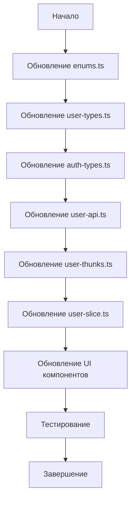

# План интеграции API эндпоинтов CRM-бэкенда

## Обзор
Документация эндпоинтов (`endpoints.md`) описывает API CRM-бэкенда. Текущая реализация фронтенда имеет некоторые расхождения с документацией. Этот план описывает необходимые изменения для приведения проекта в соответствие с документацией.

## Текущее состояние
- Проект использует TypeScript, React, Redux Toolkit, Axios
- Большинство эндпоинтов уже реализованы
- Основные расхождения: типы данных, регистр ролей, структура ответов

## Необходимые изменения

### 1. Обновление типов данных (`src/common/enums/enums.ts` и `src/store/features/user-slice/user-types.ts`)

#### 1.1. Роли пользователей
- **Текущее**: `employee`, `teamlead`, `intern` (нижний регистр)
- **Документация**: `EMPLOYEE`, `TEAMLEAD`, `INTERN` (верхний регистр)
- **Изменение**: Обновить `UserRoleEnum` на верхний регистр

#### 1.2. Коды справочников
Добавить конкретные типы для кодов из документации:

```typescript
// DepartmentCode
export const DepartmentCodeEnum = {
  SUPPORT: 'support',
  VIP_SUPPORT: 'vip_support',
  IT: 'it',
  AFFILIATE: 'affiliate',
  QUALITY: 'quality',
} as const;

// PositionCode  
export const PositionCodeEnum = {
  SUPPORT: 'support',
  VIP_SUPPORT: 'vip_support',
  AFFILIATE_MANAGER: 'affiliate_manager',
  QUALITY_MANAGER: 'quality_manager',
  BACKEND_DEVELOPER: 'backend_developer',
  FRONTEND_DEVELOPER: 'frontend_developer',
  FULLSTACK_DEVELOPER: 'fullstack_developer',
  SUPPORT_TEAMLEAD: 'support_teamlead',
  DEV_TEAMLEAD: 'dev_teamlead',
  VIP_SUPPORT_TEAMLEAD: 'vip_support_teamlead',
  QUALITY_TEAMLEAD: 'quality_teamlead',
  AFFILIATE_TEAMLEAD: 'affiliate_teamlead',
} as const;

// ShiftPreferenceCode (уже есть, но проверить соответствие)
// UserGradeCode (уже есть)
// WorkScheduleCode (уже есть)
```

#### 1.3. Структура компании
Обновить типы для ответа `/company/structure`:

```typescript
export interface CompanyStructureDepartment {
  id: string;
  code: string;
  name: string;
  isActive: boolean;
  positions: CompanyStructurePosition[];
}

export interface CompanyStructurePosition {
  id: string;
  code: string;
  name: string;
  isActive: boolean;
  workSchedule: WorkScheduleItem;
  shiftPreferences: ShiftPreferenceItem[];
  grades: GradeItem[];
}

export interface WorkScheduleItem {
  id: string;
  code: string;
  name: string;
  isActive: boolean;
}

export interface ShiftPreferenceItem {
  id: string;
  code: string;
  name: string;
  isActive: boolean;
}

export interface GradeItem {
  id: string;
  code: string;
  name: string;
  isActive: boolean;
}
```

#### 1.4. Тип для мягкого удаления
```typescript
export interface DeleteUserDto {
  isDeleted: boolean;
}
```

### 2. Обновление API клиента (`src/store/features/user-slice/user-api.ts`)

#### 2.1. Метод `deleteUser`
- **Текущее**: `deleteUser(id: string)`
- **Новое**: `deleteUser(id: string, data: DeleteUserDto)`
- **Изменение**: Изменить на `instance.delete` с телом запроса

#### 2.2. Типизация параметров
Обновить типы параметров методов для использования новых enum типов.

#### 2.3. Проверка всех методов
Убедиться, что все методы соответствуют документации по:
- URL путям
- HTTP методам
- Параметрам запроса
- Структуре ответа

### 3. Обновление Redux slice и thunks

#### 3.1. `user-thunks.ts`
- Обновить `deleteUser` thunk для передачи `DeleteUserDto`
- Обновить типы параметров и ответов
- Проверить обработку ошибок

#### 3.2. `user-slice.ts`
- Обновить обработку `deleteUser` для поддержки мягкого удаления
- Обновить типы в редьюсерах

#### 3.3. `auth-types.ts`
- Обновить `UserRoleType` на верхний регистр

### 4. Обновление UI компонентов

#### 4.1. Проверка ролей
Найти все места, где проверяются роли пользователей:
- `currentUserRole === 'teamlead'` → `currentUserRole === 'TEAMLEAD'`
- `role === 'employee'` → `role === 'EMPLOYEE'`

#### 4.2. Компоненты профиля
- `src/components/profile-view/profile-view.tsx`
- `src/pages/profile/profile-page.tsx`
- `src/pages/user-profile/user-profile-page.tsx`

Обновить для работы с новыми типами данных.

#### 4.3. Компоненты пользователей
- `src/pages/users/users-page.tsx`
- `src/components/create-user-modal/CreateUserModal.tsx`

Обновить для поддержки новых кодов справочников.

#### 4.4. Функции нормализации
Проверить функции `getDepartmentName`, `getPositionName` и другие вспомогательные функции.

### 5. Обновление констант и утилит

#### 5.1. `src/constants/constants.ts`
Проверить константы, связанные с аутентификацией и ролями.

#### 5.2. `src/constants/filter-constants.ts`
Обновить фильтры для использования новых кодов.

### 6. Тестирование

#### 6.1. Проверка API
- Проверить все эндпоинты на соответствие документации
- Тестирование аутентификации
- Тестирование CRUD операций с пользователями

#### 6.2. Проверка UI
- Тестирование отображения профиля
- Тестирование фильтрации пользователей
- Тестирование создания/редактирования пользователей
- Тестирование мягкого удаления

## Приоритетность изменений

1. **Высокий приоритет**:
   - Обновление типов ролей (верхний регистр)
   - Исправление метода `deleteUser` для мягкого удаления
   - Обновление типов для кодов справочников

2. **Средний приоритет**:
   - Обновление структуры компании
   - Обновление UI компонентов для новых типов
   - Обновление проверок ролей в UI

3. **Низкий приоритет**:
   - Рефакторинг вспомогательных функций
   - Оптимизация производительности

## Риски и зависимости

1. **Обратная совместимость**: Изменение регистра ролей может сломать существующую логику.
2. **Зависимость от бэкенда**: Предполагается, что бэкенд соответствует документации.
3. **Тестирование**: Необходимо тщательное тестирование всех изменений.

## Диаграмма последовательности обновления типов



## Следующие шаги

1. Создать резервную копию текущего состояния
2. Реализовать изменения по порядку приоритетности
3. После каждого этапа проводить тестирование
4. Документировать все изменения
5. Провести регрессионное тестирование

## Ответственные
- Frontend разработчик: реализация изменений
- QA инженер: тестирование
- Team lead: ревью кода и координация

Дата создания плана: 2026-01-10
Актуальность: до полной интеграции с бэкендом